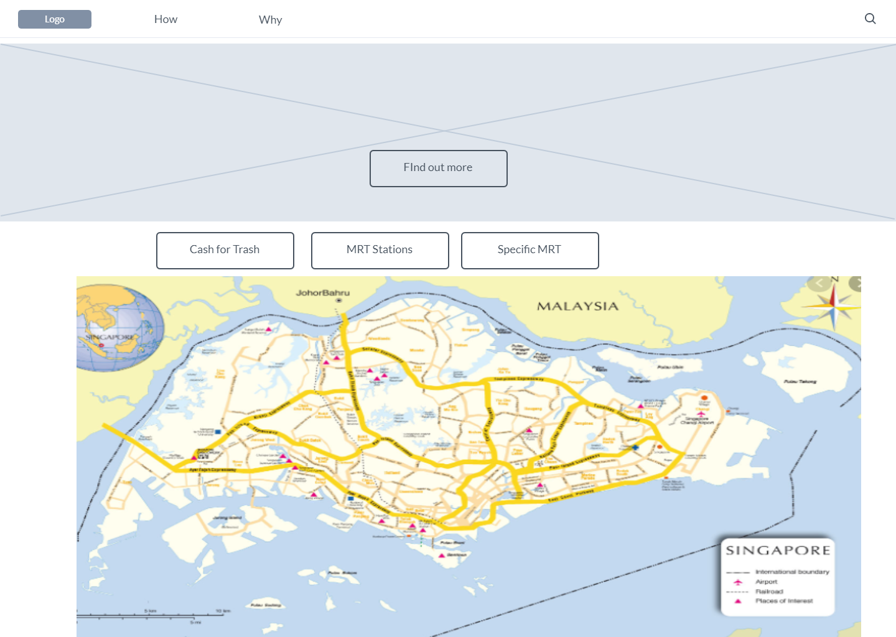
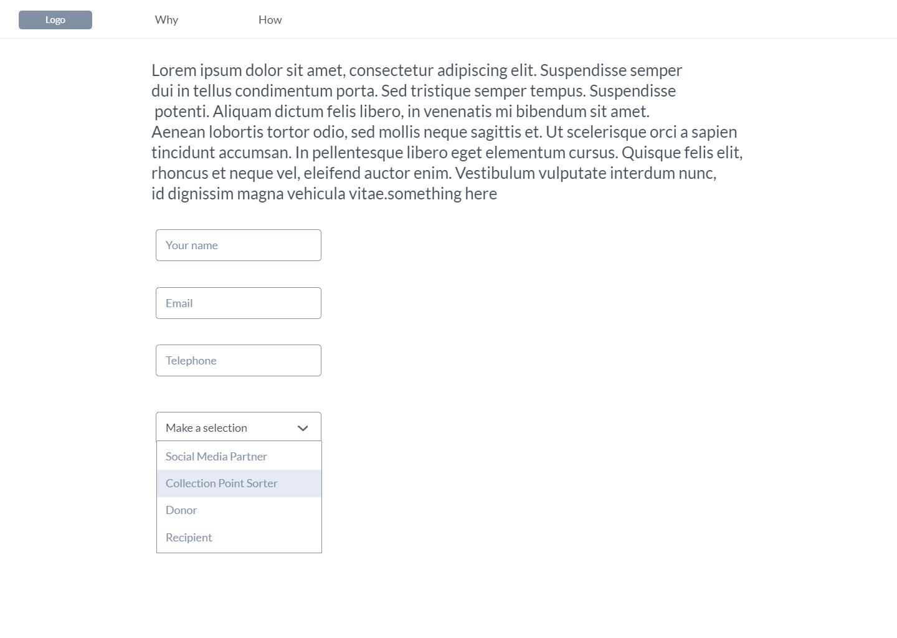
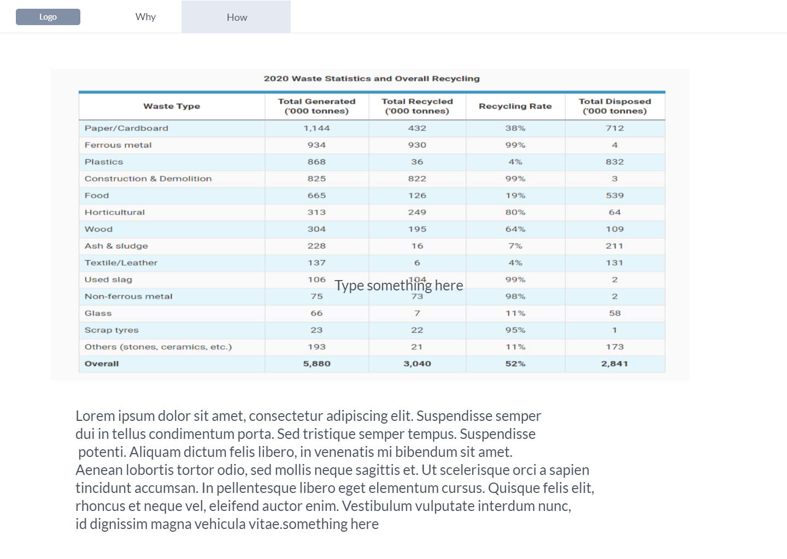
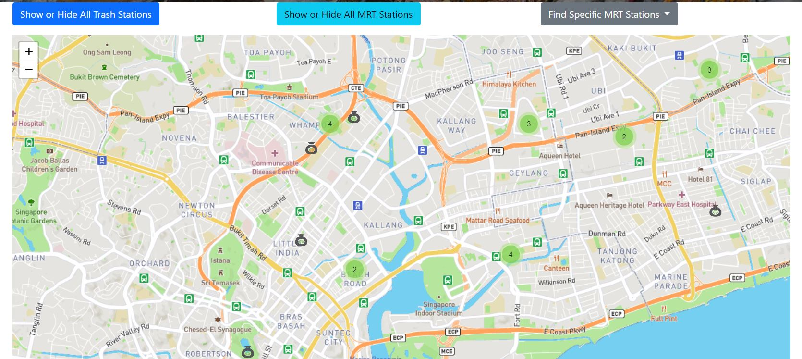
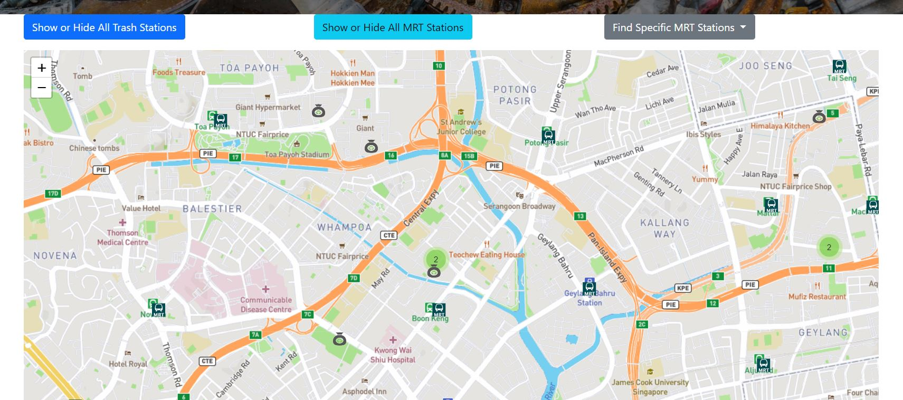
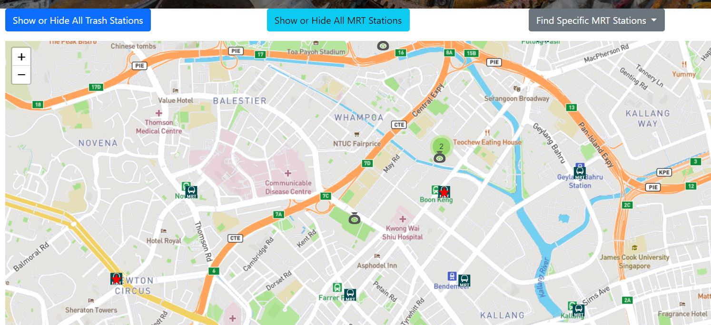

# Trent Global College Project 1 Cash for Trash
by Soh Wei Yi Pamela
Link to Website https://practical-euclid-c4ffdc.netlify.app/

## About the Project 

**Summary**   
Cash for Trash is a website to encourage users to recycle their unwanted items by bringing their waste to selected stations in exchange for cash. The website is to introduce users to recycling as well as the basic materials which can be recycled. It also includes as its main feature the locations    
of the nearest Cash for Trash stations. 

Many consumers have the habit of throwing away unwanted items due to the desire to declutter or due to lack of space in the place that they are living in. As a result, a lot of unnecessary waste is created, especially since many companies generally come up with new products or new models to generate sales from the same customer group. The goal of this project is to educate the user to consider recycling as another means of disposal of their unwanted items, as opposed to mere discarding of their unwanted waste.

**User Goal**   
 The pain points of a consumer include time taken to look for a recycling station as well as locating the nearest MRT station location of the recying station. It also includes know what type of material or object is suitable for recyling. So, the goal of the user is to have a website where they are able to find nearby recycling stations as well as to determine the nearest mrt station. 

 **Organization Goal**   
 The goal of the organization is to create awareness to the user by providing user with three layers of information: Why recycle, How to recycle and where to recycle. The goal of the organization is to solve the pain point of the user, so the information related to where to the question of where to recycle is the highlight of the website. 

**Rationale of Project**
The website will allow for easy access to locations of recycling stations as well as mrt stations. It will also be able contain relevant informaiton for the user to access in relation to recycling. 

## Project Complexity Matrix - Theme 1: Dynamic Map Application

| Items      |Remarks (FileName / Line ) |
| ----------- | ----------- |
| Consume the GET endpoint of an API, or consume a CSV/JSON file     | script.js(line 9 /line 61 )/ searchscript.js(line 5 )    |
| Adding or removing DOM elements to the display (map, DOM tree, game screen) base on user's actions  | script.js(line 36 )/ searchscript.js(line 48 and99 )         |
| Modifying the CSS of DOM elements based on the user's actions | script.js(line X )/ searchscript.js(line Y ) |
| Use of 1D traversal of array |  script.js(line 15)/ search script.js(line 16 and 22 ) |
| Each use of a unique functional mapping method (map, reduce, filter) |  script.js(line 40 )/ search script.js(line 54/ 104 ) |
| Each use of CSS layout technique (Bootstrap columns, flex box, grid) |  styles.css and index.html line 69-73 ) |
| Each possible search or filtering criteria in the user interface |  script.js(line X )/ search script.js(line 22-54 ) |
| Each case of the map updating base on the user's actions | script.js(line 46 )/ searchscript.js(line 12 and 111 ) |
| Each group of layers in the Leaflet map | script.js(line 4 )/ searchscript.js(line 26 and 66 ) |
| Each group of marker clustering | script.js(line 4)|
| Each type of custom marker (using images or custom behaviour) | script.js(line 18 )/ search script.js(line 32 and 82 ) |

## UX/UI

**Strategy**
As mentioned above, the website's objective is to help lessen the paint point of the user. In this case, the target audience would be consumers
User Needs Business Objectives

**Scope**
Functional Specifications
1) Able to locate Cash for Trash stations 
2) Able to locate MRT Stations 
3) Able to Select specific MRT Station

Content Requirements
1. Know the steps for recycling 
2. Reasons for recycling

**Structure**
Interaction Design 
1. Users are able to use 2 toggles buttons to hide and show the 2 data sets. 
2. Users are able to select a specific data point. 

Information Design 
1. First layer of information (Home Page) contains information that would be used often, as such the interactive map is the main primary feature. The secondary feature is the main picture image (hero image) with a call to action button (find out more). This allows users who need more information to access the second layer of informaiton without overwhelming them with too much information.
2. Second layer of information is clustered into bite size cards with provocative questions. This is to enable them to be able to see chunking of information and make it easy for them to read and remember the key components.  

**Skeleton**

Interface Design 
1. Able to see all the interactive buttons at one glance 

Navigation Design 
1. Contains nav bar that allows for easy access to different chunks of information

Information Design
1. Information is branched off from the main landing page

**Surface**
Visual Design 
1. Design is minimalistic (plain background) with contrasting pictures and coloured buttons to create focal point. 

**Home Page**

Why Page

How Page

## Test Cases 
**Case 1**    
User 1: New to Recycling     
Objective of User: Needs to find recycling stations locations
Step 1:    
Click on Show/ Hide Cash for Trash Stations    

 **Result for Case 1**

**Case 2**
User 2: Keen to recycle
Objective : Needs to find nearby recycling stations to MRT 
Step 1: 
Click on Show/Hide Cash for Trash Stations
Step 2:
Click on Show/Hide MRT Stations 

 **Result for Case 1**

**Case 3**
User 3: Decided to recycle
Objective: Locate specific trash stations near specified MRT
Step 1: 
Click on Show/Hide Cash for Trash Stations
Step 2:
Click on specific MRT station in dropdown list 
Step 3:
Locate the red star, MRT Station and Cash for Trash Locations 

 **Result for Case 3**

## Limitations / Areas of Improvement    
**Layers to be prioritzed**      
Layers can be far better prioritized, as there is an instance when the MRT layer will hide the specified MRT layer.    
As such, there can be further inehancement to ensure that the specified MRT layer is not hidden by the general MRT layer.    
**Removal of layers**    
At the point of the development, the removal of layers is manual and not automatic when the drop down button is used.    
**Enhancement to the How and Why pages**   
More can be done to enhance the communication of information and data for the how and why pages. This can come in the form of apex charts to provide visualization of data.   

## Deployment to Netlify
Step 1 | Sign up for an account at Netlify
Go to https://www.netlify.com/ and log in with your Github account. 

Step 2 | Commit and push your code to Github
It is possible for Netlify to directly pull the code from your Github. Hence before deploying, make sure to commit and push your latest code.

Step 3 | Create a new site from Git
Click on the green button shown below to create a new site from Github:

Step 4 | Choose Continuous Deployment
Select Github from the choices below. A pop-up window will appear and ask if you want to authorize Github -- allow it. Note if you are using Firefox or a pop-up blocker, you may have to disable it or allow Netlify to have pop-ups

Step 5 | Select or search for your repo
Select the repo that you want to deploy. After that, it will display some options. Just leave everything as it is and select the Deploy Site button.

Step 6| Wait for deployment to be done
Once it is done, you can test your site. As Netlify is capable of continuous deployment, the next time you push, your Netlify site will be automatically updated.

**Responsiveness test**
http://ami.responsivedesign.is/#

**6. Acknowledgement of code and other content that are not produced by you.**

**Use of Colour Calculator**  
https://www.sessions.edu/color-calculator-results

**Bootstrap Code**  
<!-- Broiler template from Bootstap -->
<!-- https://getbootstrap.com/docs/4.5/getting-started/introduction/ -->

**Map Code - Leafletjs**  
https://leafletjs.com/

**Data**
https://data.gov.sg/dataset/cash-for-trash

**Data Source**
https://mygeodata.cloud/converter/kml-to-geojson

**MRT Points**
https://www.kaggle.com/yxlee245/singapore-train-station-coordinates
changes to json file

**Bootstrap Items**
https://www.w3schools.com/bootstrap4/bootstrap_cards.asp

**Netlify Deployment**
https://app.netlify.com/sites/practical-euclid-c4ffdc/overview

**All Photos from www.vecteezy**
https://www.vecteezy.com

vecteezy_face-mask-pack-in-zip-lock-before-throw-into-the-trash-with-a-worm-view-from-the-inside-of-the-trash-bin_2387262

vecteezy_storing-paper-and-cardboard-of-a-supermarket_1370418

vecteezy_plastic-bottles-in-a-recycling-bin-focus-is-on-the-bottles_1393238

vecteezy_two-men-cleaning-up-park_1227644

**Deployment**
Class Deployment Guide
